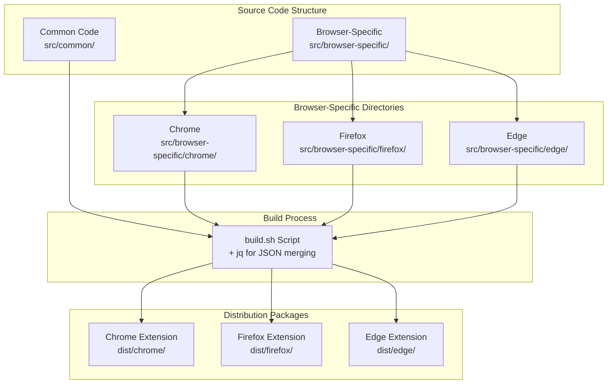

# Multi-Browser Pattern

This document explains AnkiLingoFlash's multi-browser architecture strategy, which uses a **Common + Browser-Specific** pattern to maximize code reuse while accommodating browser differences.

## Architecture Overview

AnkiLingoFlash supports three major browsers: Chrome, Firefox, and Microsoft Edge. Rather than maintaining three separate codebases, we use a sophisticated pattern that shares ~90% of the code while handling browser-specific requirements efficiently.



## Directory Structure

### Common Code (`src/common/`)

Contains shared functionality across all browsers:

```
src/common/
├── content.js              # Main content script (1,631 lines)
├── background_common.js    # Background script logic (1,177 lines)
├── popup_common.js         # Popup interface logic (1,066 lines)
├── popup.html             # Extension popup UI
├── style.css              # Comprehensive styling
├── manifest_common.json   # Common manifest properties
└── config.js              # Configuration constants
```

### Browser-Specific Code (`src/browser-specific/`)

Minimal adaptations for each browser:

```
src/browser-specific/
├── chrome/
│   ├── background.js      # Chrome-specific OAuth2 (70 lines)
│   ├── popup.js          # Chrome popup integration (31 lines)
│   └── manifest.json     # Chrome manifest + OAuth2 config
├── firefox/
│   ├── background.js      # Firefox OAuth2 implementation (90 lines)
│   ├── popup.js          # Firefox popup handling (103 lines)
│   └── manifest.json     # Firefox manifest + gecko settings
└── edge/
    ├── background.js      # Edge-specific adaptations (90 lines)
    ├── popup.js          # Edge popup integration (59 lines)
    └── manifest.json     # Edge manifest configuration
```

## Build Process

The `build.sh` script orchestrates the multi-browser build:

```bash
#!/bin/bash

BROWSERS=("chrome" "firefox" "edge")

build_for_browser() {
    local browser=$1
    local output_dir="dist/${browser}"

    # Create output directory
    mkdir -p "${output_dir}"

    # Copy common files
    cp -r _locales franc icons "${output_dir}/"
    cp src/common/popup.html "${output_dir}/"
    cp src/common/style.css "${output_dir}/"
    cp src/config.js "${output_dir}/"
    cp src/common/content.js "${output_dir}/"

    # Concatenate scripts: browser-specific + common
    cat src/browser-specific/${browser}/background.js >"${output_dir}/background.js"
    cat src/common/background_common.js >>"${output_dir}/background.js"

    cat src/browser-specific/${browser}/popup.js src/common/popup_common.js >"${output_dir}/popup.js"

    # Merge manifests using jq
    jq -s '.[0] * .[1]' src/common/manifest_common.json src/browser-specific/${browser}/manifest.json >"${output_dir}/manifest.json"
}
```

## Browser-Specific Differences

### Chrome Implementation

**API Usage**:
- Uses `chrome.*` namespace APIs
- Manifest V3 with service workers
- Chrome-specific OAuth2 implementation

**Key Differences**:
```javascript
// Chrome OAuth2 flow
chrome.identity.getAuthToken({ interactive: true }, function(token) {
    // Handle authentication
});
```

**Manifest Specifics**:
```json
{
  "oauth2": {
    "client_id": "CHROME_CLIENT_ID.apps.googleusercontent.com",
    "scopes": ["openid", "email", "profile"]
  },
  "background": {
    "service_worker": "background.js"
  }
}
```

### Firefox Implementation

**API Usage**:
- Uses `browser.*` namespace (polyfilled to `chrome.*`)
- Different OAuth2 implementation with redirect URLs
- Gecko-specific manifest properties

**Key Differences**:
```javascript
// Firefox OAuth2 flow
async function authenticateFirefox() {
    const redirectURL = browser.identity.getRedirectURL();
    const clientId = await getClientIdFromManifest();

    const authUrl = new URL("https://accounts.google.com/o/oauth2/auth");
    authUrl.searchParams.set("client_id", clientId);
    authUrl.searchParams.set("redirect_uri", redirectURL);

    return browser.identity.launchWebAuthFlow({
        url: authUrl.toString(),
        interactive: true
    });
}
```

**Manifest Specifics**:
```json
{
  "oauth2": {
    "client_id": "FIREFOX_WEB_CLIENT_ID.apps.googleusercontent.com",
    "scopes": ["openid", "email", "profile"]
  },
  "browser_specific_settings": {
    "gecko": {
      "id": "ankilingoflash@example.com",
      "strict_min_version": "109.0"
    }
  }
}
```

### Edge Implementation

**API Usage**:
- Similar to Chrome with `chrome.*` APIs
- Microsoft-specific manifest properties
- Edge Store specific configurations

**Key Differences**:
```javascript
// Edge popup handling
// Similar to Chrome but with Edge-specific configurations
```

**Manifest Specifics**:
```json
{
  "oauth2": {
    "client_id": "EDGE_CLIENT_ID.apps.googleusercontent.com",
    "scopes": ["openid", "email", "profile"]
  },
  "browser_specific_settings": {
    "edge": {
      "browser_action_next_to_addressbar": true
    }
  }
}
```

## Common Code Strategy

### API Abstraction

The common code uses abstraction patterns to handle browser differences:

```javascript
// Example: Generic API calls with browser detection
const api = typeof browser !== 'undefined' ? browser : chrome;

// Usage across browsers
api.storage.sync.get(['key'], callback);
api.runtime.sendMessage({action: 'test'}, callback);
```

### Conditional Browser Logic

```javascript
// Browser-specific behavior in common code
if (typeof chrome !== 'undefined' && chrome.identity && chrome.identity.getAuthToken) {
    // Chrome OAuth2 flow
    chrome.identity.getAuthToken({interactive: true}, callback);
} else if (typeof browser !== 'undefined' && browser.identity && browser.identity.launchWebAuthFlow) {
    // Firefox OAuth2 flow
    handleFirefoxOAuth();
}
```

### Feature Detection

```javascript
// Detect available APIs
const hasIdentityAPI = typeof chrome !== 'undefined' && chrome.identity;
const hasFirefoxAuthFlow = typeof browser !== 'undefined' && browser.identity && browser.identity.launchWebAuthFlow;
```

## Manifest Merging Strategy

### Common Manifest (`src/common/manifest_common.json`)

Contains shared properties:

```json
{
  "manifest_version": 3,
  "name": "AnkiLingoFlash",
  "version": "0.5.1",
  "description": "A browser extension for automated Anki flashcard creation",
  "permissions": [
    "contextMenus",
    "activeTab",
    "tabs",
    "storage",
    "identity",
    "scripting",
    "alarms"
  ],
  "host_permissions": [
    "http://localhost/*",
    "https://api.openai.com/*",
    "https://generativelanguage.googleapis.com/*"
  ],
  "web_accessible_resources": [{
    "resources": ["franc/*"],
    "matches": ["<all_urls>"]
  }]
}
```

### Browser-Specific Manifests

Override or add browser-specific properties:

**Chrome** (`src/browser-specific/chrome/manifest.json`):
```json
{
  "oauth2": {
    "client_id": "CHROME_CLIENT_ID.apps.googleusercontent.com",
    "scopes": ["openid", "email", "profile"]
  }
}
```

**Firefox** (`src/browser-specific/firefox/manifest.json`):
```json
{
  "oauth2": {
    "client_id": "FIREFOX_WEB_CLIENT_ID.apps.googleusercontent.com",
    "scopes": ["openid", "email", "profile"]
  },
  "browser_specific_settings": {
    "gecko": {
      "id": "ankilingoflash@example.com",
      "strict_min_version": "109.0"
    }
  }
}
```

### Merge Process

The build script uses `jq` to merge manifests:

```bash
jq -s '.[0] * .[1]' src/common/manifest_common.json src/browser-specific/${browser}/manifest.json > "${output_dir}/manifest.json"
```

This creates a final manifest with common properties plus browser-specific overrides.

## Code Organization Benefits

### 1. **Maintainability**

- **Single Source of Truth**: Core logic implemented once
- **Consistent Behavior**: Same functionality across browsers
- **Easy Updates**: Changes to common code affect all browsers

### 2. **Efficiency**

- **90% Code Reuse**: Minimal duplication
- **Reduced Testing**: Core functionality tested once
- **Faster Development**: New features implemented once

### 3. **Scalability**

- **Easy Browser Addition**: New browsers need minimal specific code
- **Future-Proof**: Architecture accommodates browser API changes
- **Flexible Adaptation**: Browser-specific features isolated

## Handling Browser Differences

### 1. **API Namespace Differences**

```javascript
// Common pattern for API access
const extensionAPI = typeof browser !== 'undefined' ? browser : chrome;

// Usage
extensionAPI.storage.sync.get(['settings'], handleSettings);
extensionAPI.runtime.sendMessage({action: 'test'}, handleResponse);
```

### 2. **Manifest Differences**

- **Chrome**: Manifest V3 with service workers
- **Firefox**: Manifest V2/V3 compatibility with gecko settings
- **Edge**: Chrome-compatible with Edge-specific properties

### 3. **OAuth2 Implementation**

- **Chrome**: `chrome.identity.getAuthToken()`
- **Firefox**: `browser.identity.launchWebAuthFlow()`
- **Edge**: Chrome-like implementation

### 4. **Permission Models**

- **Chrome**: More restrictive Manifest V3 permissions
- **Firefox**: Traditional permission model
- **Edge**: Similar to Chrome with some variations

## Testing Strategy

### Cross-Browser Testing

1. **Automated Build Testing**:
   ```bash
   # Build for all browsers
   ./build.sh

   # Verify manifests are valid
   for browser in chrome firefox edge; do
       jq empty dist/${browser}/manifest.json || echo "Invalid manifest for ${browser}"
   done
   ```

2. **Functional Testing**:
   - Test core functionality in each browser
   - Verify browser-specific features work
   - Check UI consistency

3. **Integration Testing**:
   - AnkiConnect integration
   - OAuth2 authentication flows
   - API calls and error handling

### Browser-Specific Testing

**Chrome Testing**:
```bash
# Load in Chrome developer mode
# Test Chrome identity API
# Verify service worker functionality
```

**Firefox Testing**:
```bash
# Load in about:debugging
# Test Firefox webauth flow
# Verify gecko-specific features
```

**Edge Testing**:
```bash
# Load in edge://extensions/
# Test Edge-specific configurations
# Verify Microsoft Store compatibility
```

## Best Practices

### 1. **Code Organization**

- **Keep Browser-Specific Code Minimal**: Only implement necessary differences
- **Use Feature Detection**: Prefer detection over browser sniffing
- **Abstract Common Patterns**: Create reusable functions for common operations

### 2. **Development Workflow**

```bash
# Development cycle
# 1. Make changes in common code
# 2. Test differences in browser-specific files
# 3. Build for all browsers
# 4. Test functionality across browsers
# 5. Commit changes
```

### 3. **Manifest Management**

- **Common Properties**: Put in `manifest_common.json`
- **Browser Overrides**: Use browser-specific manifests
- **Validation**: Always validate merged manifests

### 4. **API Usage**

- **Feature Detection**: Check for API availability
- **Graceful Degradation**: Provide fallbacks when APIs aren't available
- **Consistent Interface**: Use common patterns for similar functionality

## Future Considerations

### Adding New Browsers

To add a new browser (e.g., Safari):

1. **Create Browser Directory**:
   ```
   src/browser-specific/safari/
   ├── background.js
   ├── popup.js
   └── manifest.json
   ```

2. **Add to Build Script**:
   ```bash
   BROWSERS=("chrome" "firefox" "edge" "safari")
   ```

3. **Implement Safari-Specific Code**:
   - Safari Web Extensions API adaptation
   - Safari-specific manifest properties
   - Safari App Store requirements

### Architecture Evolution

- **Testing Framework**: Cross-browser automated testing
- **CI/CD Pipeline**: Automated builds for all browsers
- **Dynamic Loading**: Runtime browser detection and module loading
- **Advanced Abstraction**: More sophisticated API abstraction layer

This multi-browser pattern provides an excellent balance between code reuse and browser-specific customization, making the extension maintainable while taking advantage of each browser's unique capabilities.