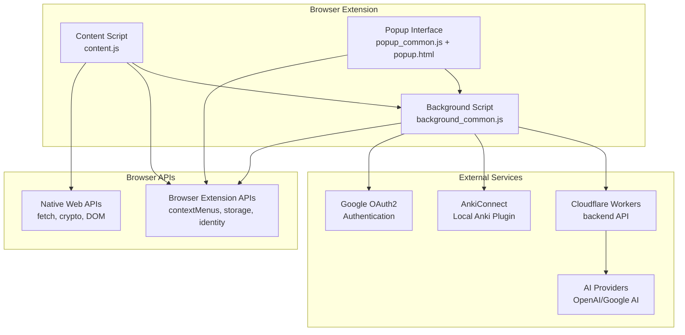
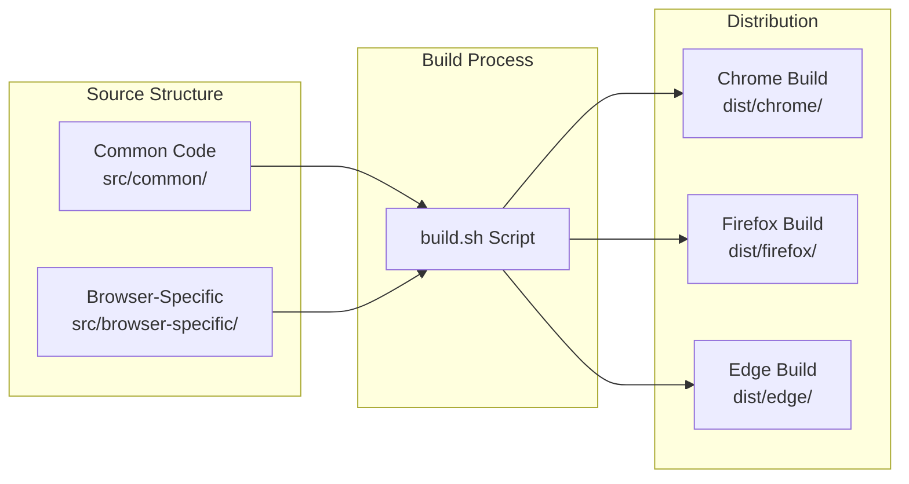
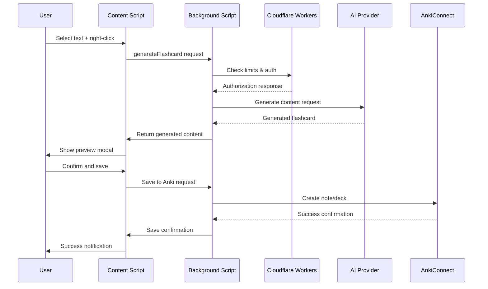
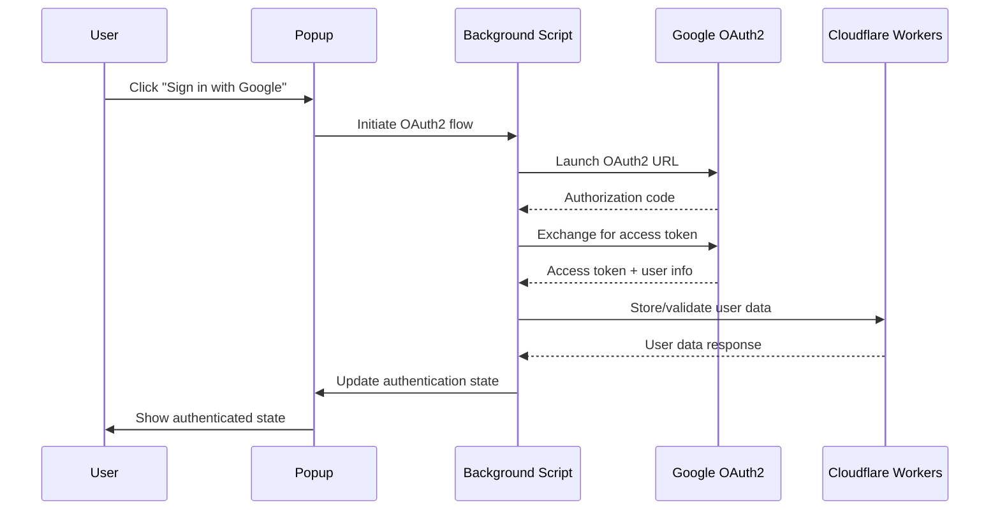
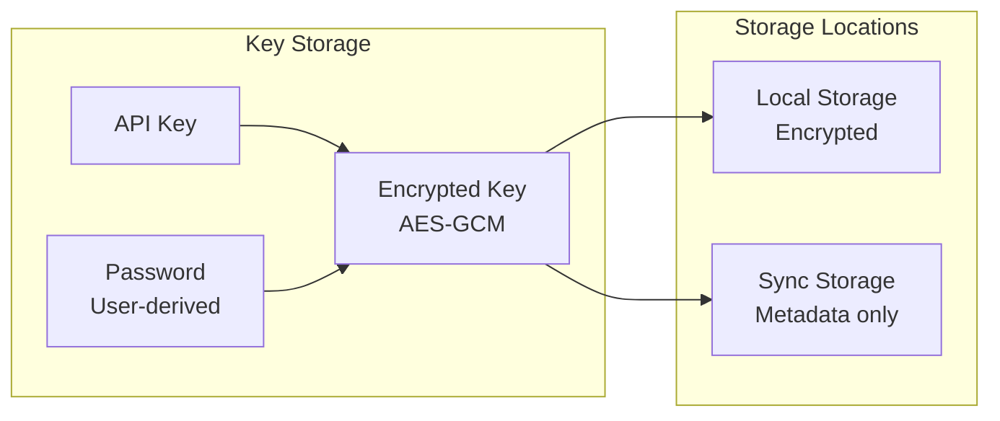

# Architecture Overview

This document provides a high-level overview of the AnkiLingoFlash system architecture, including component relationships, data flow, and key design decisions.

## System Architecture

AnkiLingoFlash uses a sophisticated multi-browser architecture that maximizes code reuse while accommodating browser-specific requirements. The system consists of several key components working together to provide automated flashcard creation.

## Core Components

### 1. Content Script (`content.js`)

**Location**: `src/common/content.js` (1,631 lines)

**Responsibilities**:
- Text selection and context menu integration
- Language detection using the Franc library
- Flashcard generation UI overlay and modal dialogs
- Toast notifications and user feedback
- Communication with background script for API calls

**Key Features**:
- Injects UI components into web pages using Shadow DOM
- Handles right-click context menu for flashcard generation
- Manages loading states and error handling
- Supports 40+ languages with automatic detection

### 2. Background Script (`background_common.js`)

**Location**: `src/common/background_common.js` (1,177 lines)

**Responsibilities**:
- OAuth2 authentication with Google services
- API key encryption and secure storage
- Rate limiting and usage tracking
- Communication with Cloudflare Workers backend
- AnkiConnect integration and API calls
- Cross-tab communication and state management

**Key Features**:
- Implements AES-GCM encryption for API keys
- Manages free tier vs premium user tracking
- Handles AI API calls to OpenAI and Google AI
- Provides retry logic and error handling
- Manages extension lifecycle and alarms

### 3. Popup Interface (`popup_common.js` + `popup.html`)

**Location**: `src/common/popup_common.js` (1,066 lines) + `src/common/popup.html`

**Responsibilities**:
- Extension settings and configuration UI
- Authentication state management
- AI provider selection and API key configuration
- User preferences and language settings
- Usage tracking display

**Key Features**:
- Responsive design with Material Design elements
- Real-time authentication state updates
- Support for both free and premium modes
- Language selection for learning goals
- Usage limit tracking and warnings

## Multi-Browser Strategy

The project uses an elegant **Common + Browser-Specific** pattern:

### Common Codebase (90% of functionality)

Located in `src/common/`, this contains:
- **content.js**: Shared content script logic
- **background_common.js**: Background script functionality
- **popup_common.js**: Popup interface logic
- **popup.html**: UI structure and styling
- **style.css**: Comprehensive styling for all UI components
- **manifest_common.json**: Common manifest properties

### Browser-Specific Adaptations (~10% of functionality)

Each browser has minimal specific files in `src/browser-specific/{browser}/`:

**Chrome** (`src/browser-specific/chrome/`):
- Uses `chrome.*` APIs
- Service worker background script
- Manifest V3 compliance
- Chrome-specific OAuth2 flow

**Firefox** (`src/browser-specific/firefox/`):
- Uses `browser.*` APIs (polyfilled to chrome.*)
- Different OAuth2 implementation
- Gecko-specific manifest properties
- Firefox extension policies

**Edge** (`src/browser-specific/edge/`):
- Similar to Chrome with Microsoft-specific configurations
- Edge store specific manifest properties

## Backend Architecture

### Cloudflare Workers Backend

**Location**: `worker.js` (321 lines)

The serverless backend provides:

**Core Endpoints**:
- `/api/chat` - AI chat completion proxy
- `/api/models` - Model availability checking
- `/api/limits` - Rate limiting and quotas
- `/api/user-data` - User data management
- `/api/generate-flashcard` - Generation authorization
- `/api/increment-flashcard-count` - Usage tracking
- `/oauth-redirect` - OAuth2 callback handler
- `/api/check-connectivity` - Health check

**Key Features**:
- **Rate Limiting**: 100 free flashcards per user
- **API Proxying**: Secure handling of OpenAI/Google AI calls
- **User Management**: Free tier tracking and premium validation
- **CORS Handling**: Cross-origin request management
- **OAuth2 Support**: Google authentication flow

## Data Flow

### Flashcard Generation Flow

### Authentication Flow

## Security Architecture

### API Key Management

The project implements robust security for API keys:

**Security Features**:
- **AES-GCM Encryption**: Strong symmetric encryption with authenticated data
- **PBKDF2 Key Derivation**: Secure password-based key generation
- **Browser Storage**: Encrypted keys stored locally, metadata in sync storage
- **Secure Transmission**: HTTPS only, with proper CORS headers
- **Content Security Policy**: Manifest V3 CSP compliance

### OAuth2 Security

- **State Parameter**: CSRF protection during OAuth2 flow
- **Redirect URL Validation**: Only allow registered redirect URLs
- **Token Storage**: Secure token handling with automatic refresh
- **Scope Limitation**: Minimal required OAuth2 scopes

## Performance Considerations

### Client-Side Optimization

- **Code Splitting**: Common + browser-specific separation
- **Bundle Size**: Optimized CSS with PurgeCSS
- **Lazy Loading**: Components loaded on demand
- **Caching**: Strategic use of browser storage and service workers

### Backend Performance

- **Edge Computing**: Cloudflare Workers for global low latency
- **Connection Pooling**: Efficient API request management
- **Rate Limiting**: Prevent abuse and ensure fair usage
- **Caching Headers**: Appropriate caching for static resources

## Scalability Architecture

The system is designed to scale effectively:

**Horizontal Scaling**:
- **Cloudflare Workers**: Auto-scaling serverless backend
- **CDN Distribution**: Global content delivery
- **Browser Extensions**: Distributed client-side processing

**Vertical Scaling**:
- **Multi-Provider AI**: Support for multiple AI providers
- **Configurable Limits**: Adjustable rate limiting
- **Modular Design**: Easy addition of new features

## Design Decisions

### Why Multi-Browser Architecture?

**Decision**: Use common codebase with browser-specific adaptations

**Rationale**:
- **Maintainability**: Single codebase for core functionality
- **Consistency**: Uniform user experience across browsers
- **Efficiency**: 90% code reuse, minimal duplication
- **Future-Proof**: Easy addition of new browsers

### Why Cloudflare Workers?

**Decision**: Serverless backend on Cloudflare Workers

**Rationale**:
- **Global Performance**: Edge computing for low latency
- **Cost Efficiency**: Pay-per-use pricing model
- **Scalability**: Automatic scaling without management
- **Security**: Built-in DDoS protection and SSL

### Why Separation of Concerns?

**Decision**: Clear separation between content, background, and popup components

**Rationale**:
- **Security**: Content script isolation from privileged APIs
- **Performance**: Background processing without UI blocking
- **Maintainability**: Clear component responsibilities
- **Testing**: Individual component testing capability

## Future Architecture Considerations

### Potential Enhancements

1. **Testing Framework**: Automated testing for multi-browser compatibility
2. **CI/CD Pipeline**: Automated builds and deployments
3. **Analytics Integration**: Usage tracking and performance monitoring
4. **Plugin System**: Extensible architecture for third-party integrations
5. **Offline Support**: Local AI model integration

### Architectural Debt

1. **Monolithic Components**: Some large files could benefit from splitting
2. **Error Handling**: Could benefit from centralized error management
3. **Configuration**: Could use more sophisticated configuration management
4. **Documentation**: API documentation could be auto-generated

This architecture provides a solid foundation for the current feature set while allowing for future growth and enhancement. The multi-browser strategy, combined with the serverless backend, creates a scalable, maintainable, and secure system for automated flashcard generation.